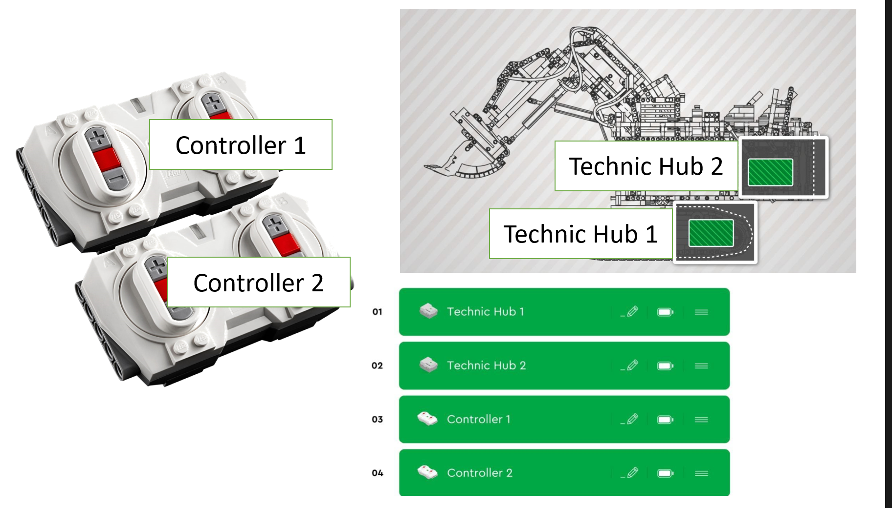

# LEGO 42100 Liebherr R 9800 Excavator: powered-up app controller

This powered up program makes it possible to control a LEGO 42100 Liebherr R 9800 Excavator by using the hand controller of the LEGO City trains. Two controller (https://www.lego.com/en-gb/product/remote-control-88010) are required for the program.

How the controller works is shown in this video https://www.youtube.com/watch?v=DjFeJ_h1GU4. 

In order to control all 7 motors by using only 2 controller (you can't connect more than 4 powered up hubs/ controllers to the powered up app at the same time, so 2 controller are a upper limit for the Liebherr) two *control modes* are required. 

## Control mode 1
This control mode is used to control the lower Technic Smart Hub i. e. the driving and rotating the superstructure.

## Control mode 2
This control mode is used to control the upper Technic Smart Hub i. e. the movement of the boom/ excavator arm.

## Switching the modes
The different modes can be switched by pressing the red buttons of a controller at the same time. The switching is indicated by the controller's LED. The *control mode* can be switched by using the upper controller. The *motor mode* can be switched by using the lower controller. Motor mode 1 (default) means that the motors are only moving as long as the buttons of the controller are pressed. Motor mode 2 means that after pressing a button the selected motor moves as long until another button has been pressed. The red button works as stop button. Note that you should only press one stop button per controller at the same time if you want to stop a motor (since pressing both stop buttons of a controller at the same time switches the control modes).

# Use the program yourself

Unfortunately the powered up app does not support importing and exporting of self written programs. Anyway there are two options that you too can use the program for your Liebherr.

## First option: Copy the program file into the powered up folder

Follow this tutorial https://racingbrick.com/2020/01/how-to-export-import-a-project-in-the-powered-up-app-on-android/. Basically you need to copy this [file](4a2a2596-47d9-4242-ba9e-173a8d622262) (download the whole repository before) into the powered up folder of your phone, for android *Internal Storage/Android/data/com.lego.common.poweredup/files/Activities*.

This method worked for me fine moving the program from an Adroid phone to an Android tablet. Not sure about the compatibility with apple devices, so if the first option doesn't work for you, try the 2nd option.

## Second option: Reprogram

This will take you definetly longer than the first option - but in doing so, you may understand how the program works and how you can adapt it to your personal requirements. 

## Actually use the program

1. Make sure that you imported the program using one of the above options
2. Open the powered-up app
3. Connect the two Technic Smart Hubs and the two controller
4. Make sure that the order of the connected hubs/ controllers are ordered like this:
    
5. Run the program i. e. you need to press the green start button inside the powered up app. If the program runs, the controller's LED should change their color. 
